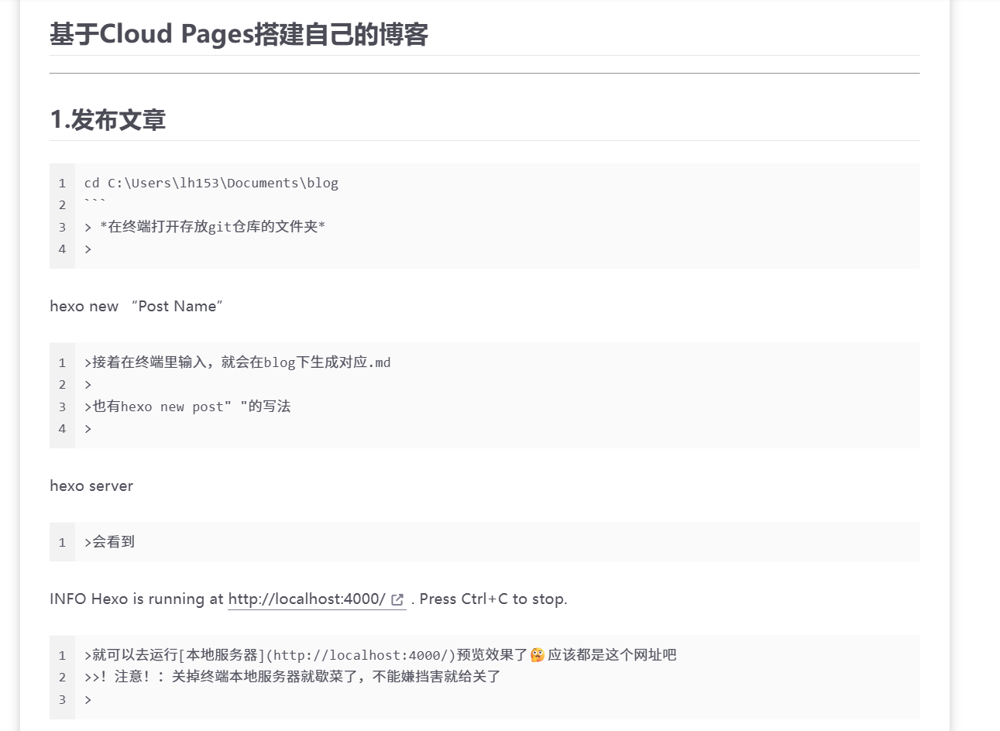

# 基于Cloud Pages搭建自己的博客
---
## 1.发布文章


```bash
cd C:\Users\lh153\Documents\blog     
```

> 在终端打开存放git仓库的文件夹
>

```bash
hexo new "Post Name"
```

>接着在终端里输入，就会在blog下生成对应.md
>
>也有hexo new post" "的写法
>

```bash
hexo server
```

>会看到

```bash
INFO  Hexo is running at http://localhost:4000/ . Press Ctrl+C to stop.
```

>就可以去运行[本地服务器](http://localhost:4000/)预览效果了🤔应该都是这个网址吧,几乎是实时预览的🤔
>>tips：关掉终端本地服务器就歇菜了，不能嫌挡害就给关了
>

```bash
git add .
git commit -m "xxx" //xxx是用来记录操作记录的命名，eg:new post
git push
git add .
git commit -m "New post"
git push
```

>会更新github仓库🤔
>>tips：记得Ctrl+S！
>

接下来再去cloudflare---→Workers & pages---→你的项目---→Deployments---→Retry Deplotment

等到部署完，你的博客就会更新啦


## 2.乱序问题



  原理应该就是本地的 VS Code 和线上的博客系统（比如 Hexo）使用的是不同Markdown 解析器，而VS Code 的解析器比较宽容。当你的 Markdown 语法格式有一点小瑕疵，Hexo 解析就会错位。

目前我用着好使的解决办法 :
* 在 \``` 的上方和下方，一定要各留一个空行。不要让它和普通文本或 > 引用紧紧贴在一起。而且在代码块开头附加语言名称(eg:  \```     bash)
* 总之多打空格🤔这个换行或者留空就很神奇，我也没研究明白🤔

## 3.图片上传问题
一开始我很理想当然的，在.md所在文件夹新建 images，往里丢图片，当时vscode里有图片，本地预览看不见。现在就集贸的都正常了🤬🤬🤬🤬我真草了。
### 还是记录一下我忙活一个点怎么解决传图片的问题吧
1. 要在.md上一级文件夹新建images，往里丢图片
2. 然后修改图片路径为绝对路径 (eg:/images/Belike.png)
>tips：相对路径 image/Belike.png  image在.md所在文件夹
>

## 4.关于github
仓库有 main ，以前叫master，也有branch，相当于是类的对象，用拷贝构造函数构造出的main对象

```cpp
class master : public main;
```

由于笨比AI，他给你命令行会默认master，这就导致会建一个没有任何必要的branch，如果只修改main后续也会轻松很多。

## 5.关于Cloudflare Deployment
你每次部署都会产生一个历史版本Preview，他会默认把main当成Production，即正式版，直接决定了你的博客长啥样，好像不能随意切换，具体我也没搞明白，这都算小事了，问问哈基米都会